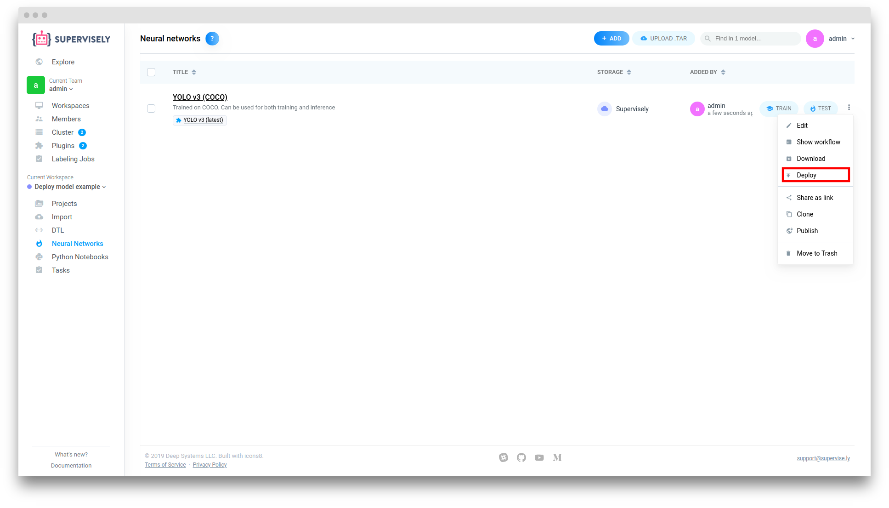
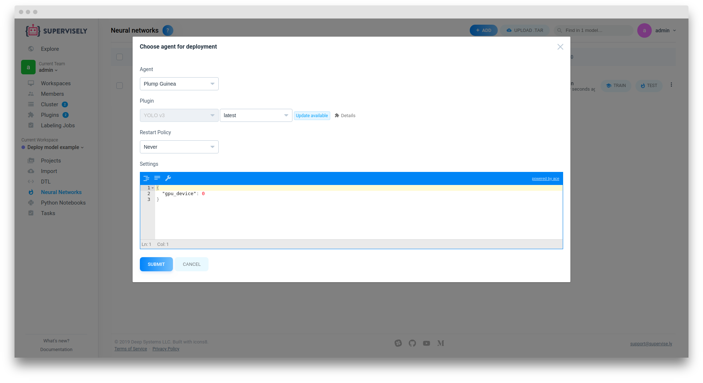
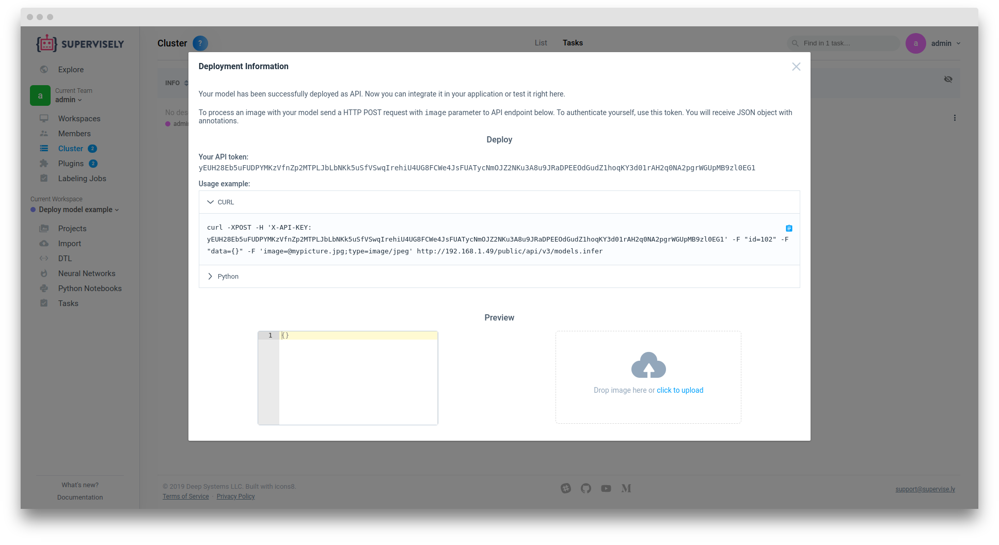
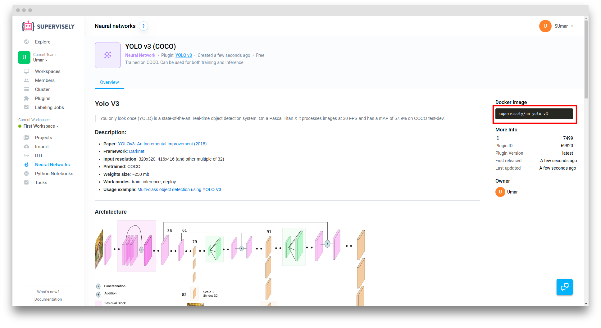
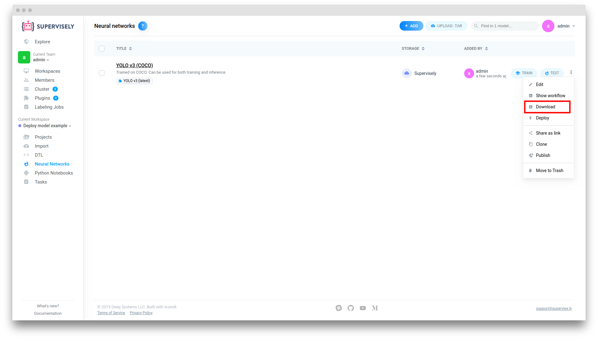

# Model deployment

After you have trained a neural network (or selected already pre-trained one from Explore page) you can apply it within Supervisely on a Project (via "Test" button) or deploy it as API.

We support two methods of API deployment: through Web UI or completely stand alone.


## Method 1: Through UI

Easiest method, fully managed by Supervisely.

1. Go to the "Neural Networks" page. Click "three dots" icon on the model you want to deploy and select "Deploy". Deployment settings dialog will be opened


2. Here you can setup deployment settings. After clicking "Submit" button and you will be redirected to the Cluster > Tasks page


3. Wait until value in the "output" column will be changed to "Deployed", click on "three dots" and select "Deploy API Info"


4. Here you can see deployed model usage example though CURL or Python. You also can just drag'n'drop image to test your deployed model right in the browser


## Method 2: Stand alone

Choose this method if you want to deploy model in production environment without Supervisely

1. Obtain docker image of the model. You can find it on right side at the model page


2. Download model weights and extract .tar archive


3. Then run following in your terminal

```sh
$ docker run --rm -it \
    --runtime=nvidia \
    -p 5000:5000 \
    -v '<folder with extracted model weights>:/sly_task_data/model' \
    <model docker image> \
    python /workdir/src/rest_inference.py
```

for example

```sh
$ docker run --rm -it \
    --runtime=nvidia \
    -p 5000:5000 \
    -v '/home/user/Downloads/YOLO v3 (COCO):/sly_task_data/model' \
    supervisely/nn-yolo-v3 python \
    python /workdir/src/rest_inference.py
```


4. Test deployed model

```
curl -X POST -F "image=@[/path/to/image.png]" 0.0.0.0:5000/model/inference
```

for example
```sh
curl -X POST -F "image=@/home/user/Downloads/01.jpg" 0.0.0.0:5000/model/inference
```
