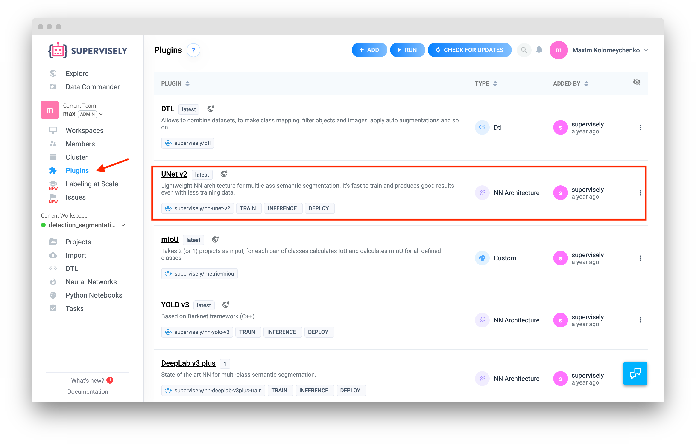
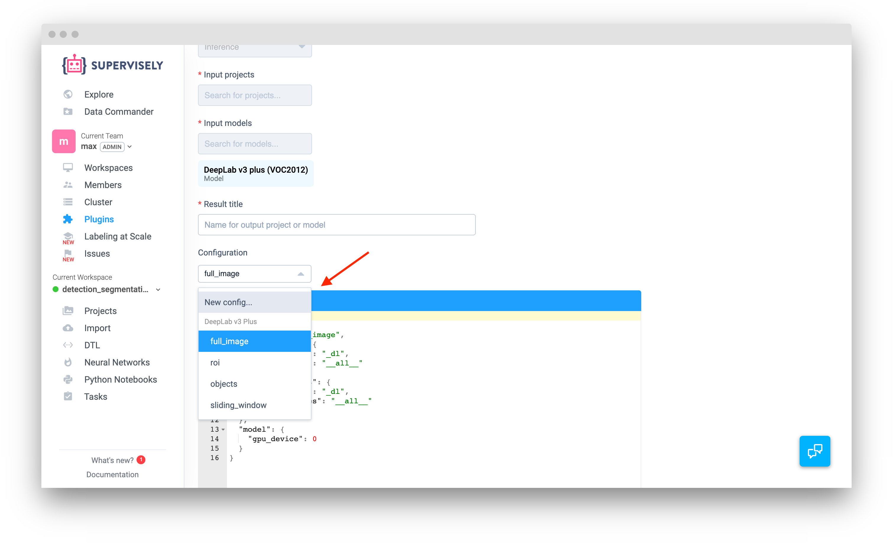
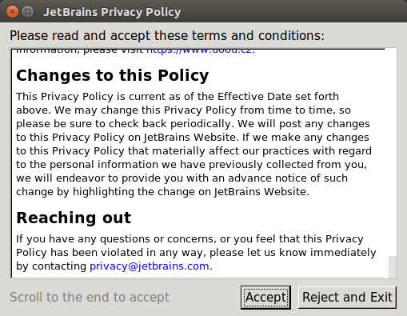
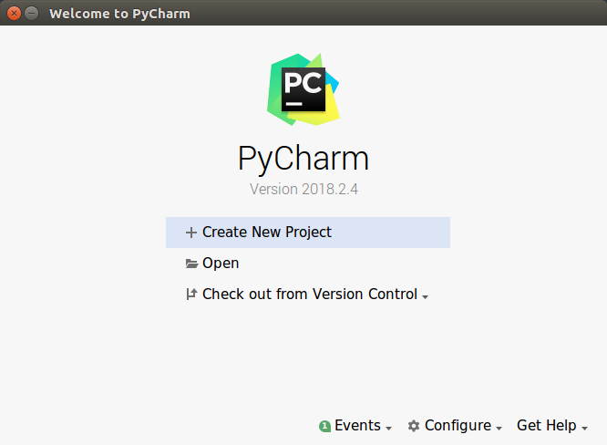
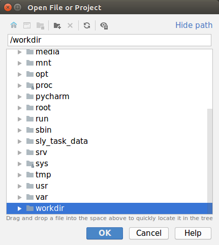
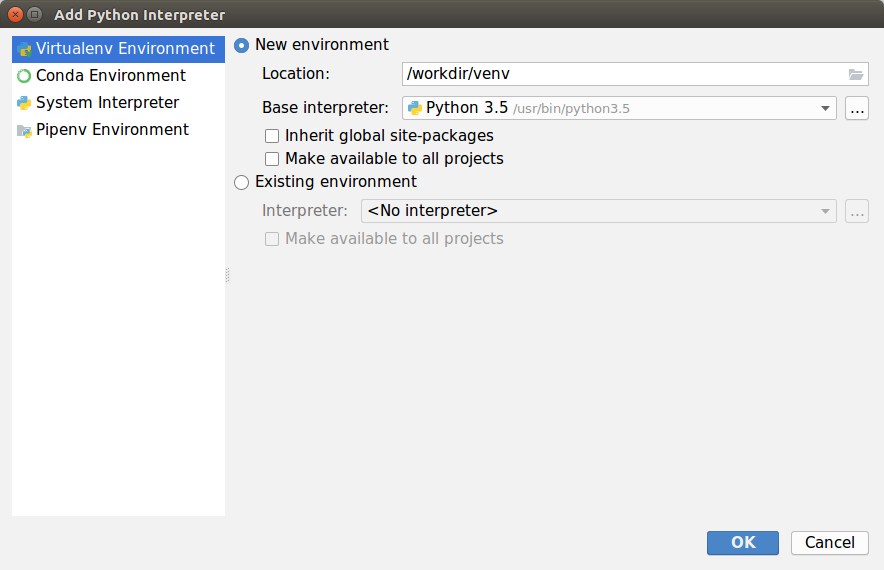
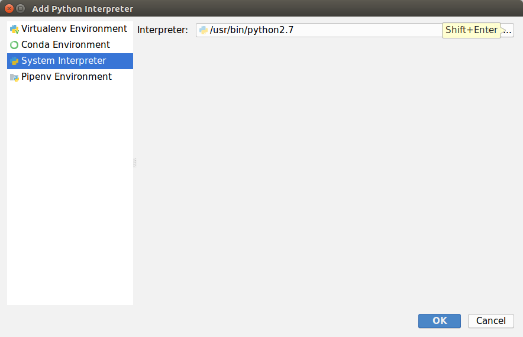
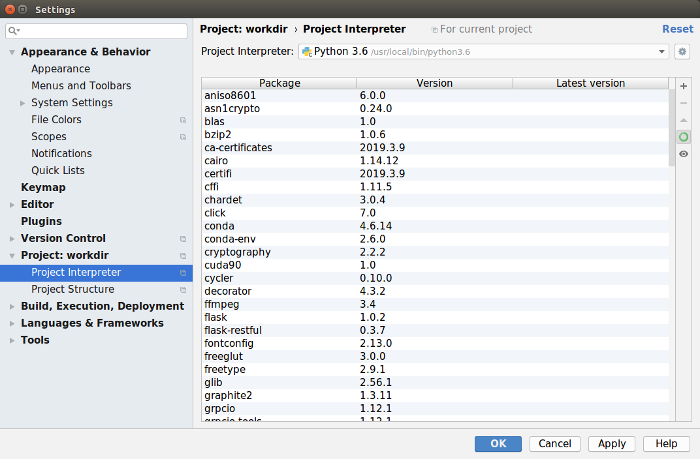
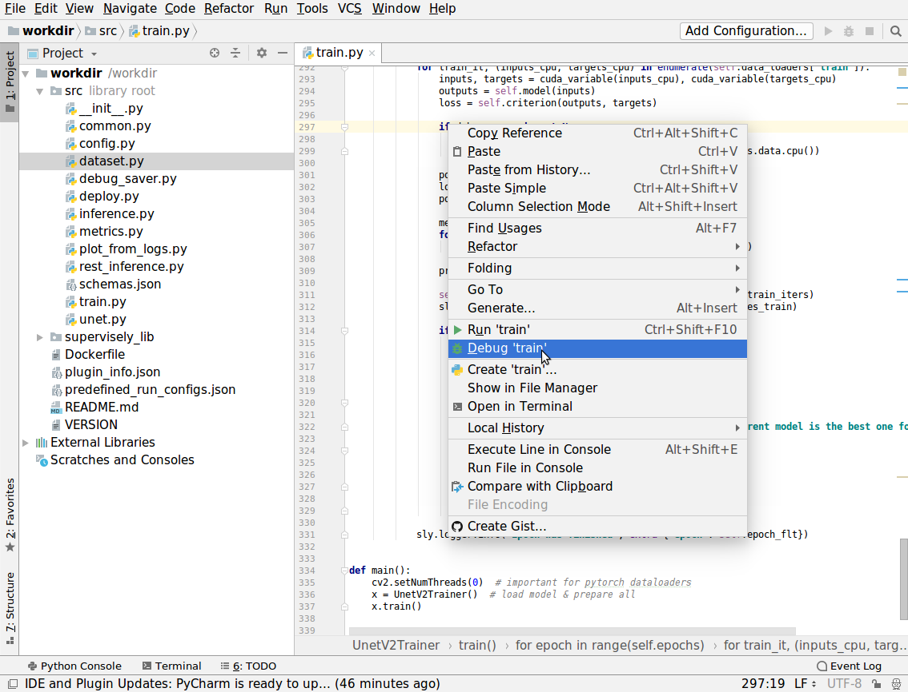

## How to develop and debug NN plugin

Before developing your custom NN plugin, it is recommended to look at the following tutorials

1. [Agent explanation](../../../../agent)
2. [How to create plugin](../01_create_new_plugin/how_to_create_plugin.md) 
3. [General detailed guide: Integrate any custom neural network](./tutorials/03_custom_neural_net_plugin/custom_nn_plugin.md)
4. [Easy guide: Integrate a custom Pytorch Segmentation neural network](../02_pytorch_easy_segmentation_plugin/pytorch_segmentation_integration_template.md)

## How agent communicates with NN plugin

Here is the [principal scheme](../../../../agent) that describes what agent is and how agent works. The main idea behind basic Supervisely plugins is the following: plugin works directly with hard drive, it reads input data and some settings from input directory and produces result to another directory, and all logs are printed to STDOUT. It allows to develop, run and use any plugin in isolation from Supervisely ecosystem. Therefore Agent downloads all necessary data for the plugin, parses and submits its STDOUT and uploads plugin results to the main Supervisely server.       

NOTICE: Also there are some advanced versions of plugins that can directly communicates with Supervisely instance via API without agent, but it is not covered by this tutorial.


## NN plugin structure

Let's take a look at the example: [UNet plugin](https://github.com/supervisely/supervisely/tree/master/plugins/nn/unet_v2). Directory structure is the following:

```
<plugin directory>
├── Dockerfile
├── plugin_info.json
├── predefined_run_configs.json
├── README.md
├── src
│   ├── <some sources here, you can use any directory structure you want>
│   ├── deploy.py
│   ├── inference.py
│   └── train.py
└── VERSION
```

Let's look into every file:
1. ```plugin_info.json``` 
contains some information that shortly describes plugin. This information is packed into  docker image to the special label. Docker image building step will be described later. After you build it to docker image and attach it ot the Supervisely platform, this information will look something like this:




It contains the following json ([example](https://github.com/supervisely/supervisely/blob/master/plugins/nn/unet_v2/plugin_info.json)):
```
{
	"title": "<plugin name>",
	"description": "<short description>",
	"type": "architecture"
}
```

```type``` field is a type of plugin. It is using in UI and Supervisely supports different plugin types: ("dtl", "architecture" - for NN plugins, "custom", "import", "general_plugin" - for advanced usage. 


2. ```README.md``` 
Some useful information about plugin, that you would like to share with users. [For example](https://supervise.ly/explore/plugins/u-net-v-2-69818/overview): how to run NN, some configs explanation, examples of predition, etc. This information is packed into  docker image to the special label. Docker image building step will be described later.


3. ```Dockerfile``` is used during building docker image ([example](https://github.com/supervisely/supervisely/blob/master/plugins/nn/unet_v2/Dockerfile))

4. ```predefined_run_configs.json``` ([example](https://github.com/supervisely/supervisely/blob/master/plugins/nn/unet_v2/predefined_run_configs.json)). This configs are available on the "Run plugin" page. For example, when you start training or inference. This config is a way to pass some settings from UI to the plugin, e.g. how to run NN (full image or sliding window manner). You can pass any settings you want, as long as you implement the usage of the fields. This information is packed into  docker image to the special label.

 

5. ```VERSION``` - file is docker image name and version ([example](https://github.com/supervisely/supervisely/blob/master/plugins/nn/unet_v2/VERSION)). Is used to name docker image and define tag for it. Advanced users can use it in CI.

```
<image_name>:<image tag> 
```

6. ```train.py```, ```inference.py```, ```deploy.py``` files are responsible for corresponding running modes. For example, if file ```deploy.py``` is missing, deploy mode will be unavailable in UI. The list of available modes is packing to docker image labels during docker image building.


## How to build plugin to docker image


Read how to build docker image for plugin and how to add it to the platform [here](https://github.com/supervisely/supervisely/blob/master/help/tutorials/01_create_new_plugin/how_to_create_plugin.md#build-and-publish-the-plugin-docker-image).  


## Directory that will be mounted to container

Once you have a directory with input data, you can start development/debugging process. This section explains the the structure of the input directories for training, inference and deploy modes for UNet plugin. You can take examples and use them as a quick start.


[task_training_example.tar](https://cloud.deepsystems.io/s/nfOtXAD2a2B6hY2/download)

[task_inference_example.tar](https://cloud.deepsystems.io/s/ZjK6xUNk5CaKIUL/download)

[task_deploy_example.tar](https://cloud.deepsystems.io/s/XxzmZc4IzRqDzRN/download)


NOTICE: this directories can be obtained if you will run agent with environment variable ```DELETE_TASK_DIR_ON_FINISH``` with value ```false``` (default value is ```true```). Then you can go to ```<agent directory>/tasks/<task-id>```

### How to run in development mode

Let's consider the example with UNet plugin. 

Here is the bash command that is needed to mount necessary directories. In this example we will run PyCharm CE right inside container and use GUI for development/debug. You can change the script to modify this behaviour. 


```
nvidia-docker run \
    --rm \
    -ti \
    -e DISPLAY=$DISPLAY \
    -v /tmp/.X11-unix:/tmp/.X11-unix \
    -v ~/.Xauthority:/root/.Xauthority \
    --entrypoint="" \
    --shm-size='1G' \
    -e PYTHONUNBUFFERED='1' \
    -v ${PWD}/src:/workdir/src \
    -v ${PWD}/../../../supervisely_lib:/workdir/supervisely_lib \
    -v /home/ds/work/examples_sly_task_data/inference/:/sly_task_data \
    -v /home/ds/soft/pycharm:/pycharm \
    -v /home/ds/pycharm-settings/unet_v2:/root/.PyCharmCE2018.2 \
    -v /home/ds/pycharm-settings/unet_v2__idea:/workdir/.idea \
    supervisely/nn-unet-v2:latest \
    bash
```

Just create a script ```./run_plugin_dev.sh``` and put it to the root directory of your plugin. Before you run the script, please execute command ```xhost +``` (X11 is not working otherwise. This command should be executed only once until you restart computer). 


Lets slice and dice the run command above:

1. for X11 support (to be able to run GUI app inside container, in our case it will be PyCharm CE):
```
-e DISPLAY=$DISPLAY \
-v /tmp/.X11-unix:/tmp/.X11-unix \
-v ~/.Xauthority:/root/.Xauthority \
```

2. Override the default entrypoint:
```
--entrypoint="" \
```

3. we should mount two directories: plugin sources and supervisely lib. It allows to change the files inside the container and they will be automatically change on your host machine (because you are working directly with files from host inside a container). If you will not do it, all changes in sources will be missed when you exit container.

```
-v ${PWD}/src:/workdir/src \
-v ${PWD}/../../../supervisely_lib:/workdir/supervisely_lib \
```

4. Mount directory with input data

```
-v /home/ds/work/train_data_example:/sly_task_data \
```

5. Mount directoty with PyCharm app 
```
-v /home/ds/soft/pycharm:/pycharm \
```

6. Mount directories to store python interpreter index (optional). It helps to speed up python indexing. You can run and kill container as many times as you want. Python cache will not be affected and all available packages will be indexed in a seconds (instead of minutes). 

```
-v /home/ds/pycharm-settings/unet_v2:/root/.PyCharmCE2018.2 \
-v /home/ds/pycharm-settings/unet_v2__idea:/workdir/.idea \
```

Do not forget to change ```PyCharmCE2018.2``` to your version

7. Docker image name

```
supervisely/nn-unet-v2:latest \
```

8. Command to run
```
bash
```

Once you modify the script and execute, you will be inside container's bash. 


### Run IDE inside a container

NOTICE: most of the steps (98%) below you have to do only once at first launch. 

1. Run command to start PyCharm CE, that we've mounted earlier.

```
/pycharm/bin/pycharm.sh
```

2. IDE is started. Scroll licanse agreement and press "Accept" button



3. During the first launch, you will see the following. Press "Open"



4. Choose directory ```/workdir``` and press "OK"



5. Now you see an opened PyCharm project


6. Define Correct Interpreter for your project

Go to "File"->"Settings..."->"Project: workdir"


Click "Project interpreter link"


Click "Settings (icon)" on the right top corner -> "Add button". You will see the following "Add python interpreter window"



Choose "System interpreter" page on the left 



And press "three dots" button on the right. You will see the following window. Just select path ```/usr/local/bin/python3.6``` and press "OK" button. 

Once you choose correct interpreter you will see the list of available packages:



Press OK button. And wait until interpreter indexing will be finished (again, it's a one time procedure).

Now you can chose ```src/train.py``` (or ```inference.py``` or ```deploy.py```) and start debugging!



### Tech support

If you will ahve any questions regarding implementing custom NN plugins, or some missed or unclear parts in this guide, please contact tech support and we will help.

