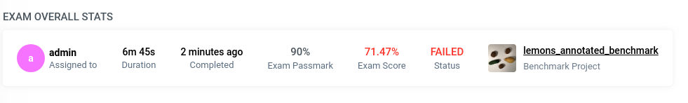
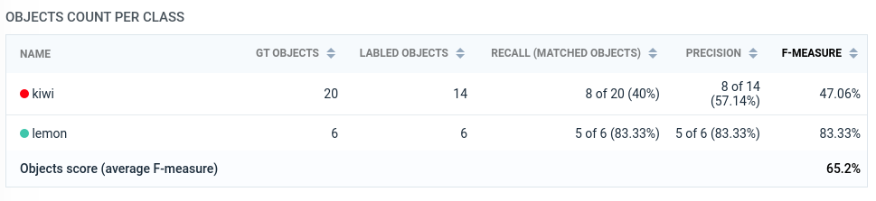
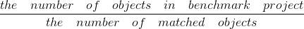
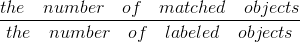
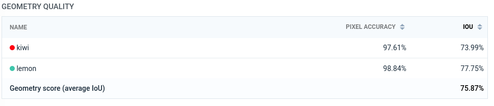
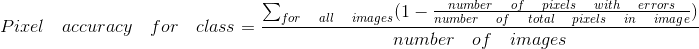
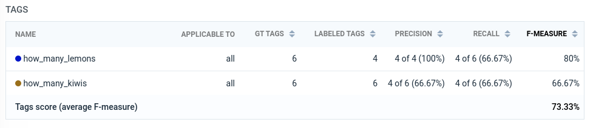
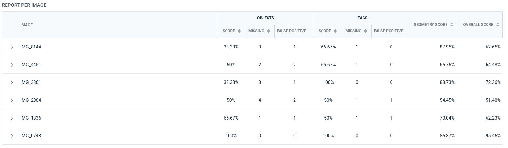
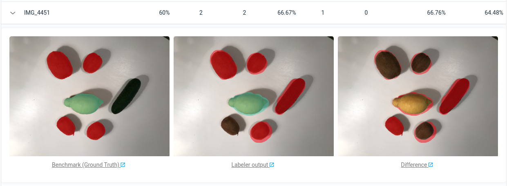

# Exam report explanation

You can find a brief overview of Labeling Exams [here](https://medium.com/deep-systems/labeling-guides-exams-new-supervisely-tools-to-teach-workforce-on-your-custom-labeling-task-356095941482)

Let's take a look at the report. It consists of several parts:
1. Overall stats
2. Objects count per class
3. Geometry quality
4. Tags
5. Report per image

# Overall stats

Overall stats shows:
* To whom the exam was assigned to
* How much time labeler spent on the exam (duration)
* Exam passmark - this is the minimum quality threshold (in percents) that needs to be achieved
* Exam score - the overall quality of labeling. This value considers a lot of different metrics that will be explained below. The color indicates whether the exam is passed (green) or not (red)
* Link to the original benchmark project - benchmark project is the gold standard for labeling tasks. It should contain both basic and edge labeling cases. The more diverse it is, the fairer the labeler’s assessment will be.

NOTICE: Currently, the Exams module supports basic geometries (polygon, bitmap, rectangle) and objects/images tags. Polyline and graph (keypoints) geometries will be supported in the next release.

Before we dive into the metrics calculation, there is an essential step for the entire process: objects matching.

# How the objects are matched together

## Remember what the order of the objects is

Let’s take a look at a semantic segmentation case for a self-driving car. How do we label objects in complex scenes: with or without the intersection? The best practice is to annotate objects with an intersection and then arrange them in the right order. Many public datasets are labeled this way (Cityscapes, Mappilary). 
Opacity tool allows us to see the final segmentation in real-time during the annotation. Supervisely supports these features out of the box.

## Objects matching

1. Render all objects of all classes to get effective masks (this means that objects masks won’t have intersections after rendering, i.e. each pixel belongs to only one object/class). See the example above (with opacity equal to 1).
2. Every object that was created by the labeler is compared against all objects of the same class on the same image in the benchmark project. For every matched pair of objects, we calculate IoU (follow [here](https://supervise.ly/explore/plugins/m-io-u-69819/overview)) and choose the pair with the maximum value. If the maximum IoU value is less then 0.8 the matching pair is skipped (it means that labeled object was not matched).  to find more intuition and theory about the IoU metric) and choose the pair with the maximum value. If the maximum IoU value is less then 0.8 the matching pair is skipped (it means that labeled object was not matched). 

As a result, we find both matched and not matched objects according to the IoU threshold. 

NOTICE: Right now it’s not possible to change the IoU matching threshold (the default value == 0.8). In the next release, this parameter will be added to the "Create Exam" page and will be available for customization.

# Objects count per class

Let's start with the first metric that is used in the Exam Score calculation. First of all, regardless of the pixel-level quality, it’s a good idea to evaluate how labeler understands the task by counting how many objects were labeled and how does this number correlate with the Ground Truth (GT) objects count. 

However, there are some complex moments at work here. Let's take a look at the following example: the annotator has to label persons on an image. Let's say, there are 5 persons in the GT annotation and the labeler just randomly labeled 5 areas on the image. If we compare only the number of objects while overlooking their locations, the objects score will be 100% (number of labeled objects == 5, number of objects in GT == 5, 5 == 5 => success). This is how all quiz-based systems work which is not enough for labeling examination. That’s why we match objects before the calculation of Objects Count score.

Columns of the table "Objects count per class"
- GT Objects - the total number of objects of the corresponding class in the Benchmark Project
- Labeled Objects - the total number of objects of the corresponding class in the Labeled Project

- Recall (Matched objects)  

- Precision  

- F-measure (F1 score) [Wikipedia article](https://en.wikipedia.org/wiki/F1_score). It’s a combination of both precision and recall. F-measure is calculated for every object class. 

**Object Score** is an average of all F-measures of all classes. The title of the column that is used for averaging is marked in bold.

**Object Score** is the first component of **Exam Score**.    

# Geometry quality

For every class (! not for every object instance !) we start by rendering the effective mask (Class effective mask) (i.e. it’s a rendering of all effective masks of all objects belonging to the class). This gives us GT and Labeled class effective masks for all images.

- Pixel accuracy equation 

Here’s the intuition behind this: we can calculate Pixel Accuracy for every image. Pixel Accuracy = 1 - Pixel Error. Pixel error is the number of pixels labeled with errors divided by the total number of pixels.  

- Intersection over Union - explanation can be found [here](https://supervise.ly/explore/plugins/m-io-u-69819/overview)

**Geometry Score** is an average of all IoU of all classes. The title of the column that is used for averaging is marked in bold.

**Geometry Score** is the second component of **Exam Score**.

# Tags Score

Tags score calculation is similar to the objects count calculation. It’s based on objects matching. First of all, we compare GT and Labeled tags that are assigned to the corresponding images. The tag is considered matched if the tag type and the tag value (optional) are equal to the GT. We calculate this comparison for image tags and for all tags of the matched objects.

The intuition behind precision: how many labeled tags are matched.

Intuition behind recall: how many GT tags are matched.

- F-measure (F1 score) [Wikipedia article](https://en.wikipedia.org/wiki/F1_score). It’s a combination of both precision and recall. F-measure is calculated for every type of tag. 

If the exam does not contain tags, **Tags Score** is ignored during the **Exam score** calculation.

# Report per image

This table allows us to sort the images by the required field. For example, you can quickly find images with the lowest geometry score, or images with the highest number of mismatched objects. Fields are the same as in tables we described previously but all values are calculated for a single image.
Here you can see the detailed report for every image. You will see the GT, the labeled image, and the difference. Red color indicates the mistakes - differences in labeling on pixel level for any class. If the pixel is red, it means that the class of the pixel in GT differs from the class in the labeling.
Under every image, you will find a link to the labeling interface. It’s useful when you would like to zoom in and investigate the differences between GT and labeling. Links are available only to the users with the corresponding permissions (users with the role "labeler" don't see the links).

# Exam score

Exam score is the average of the objects count score, the tags score (optional) and the geometry score. These values are marked in bold in corresponding tables.
